# Process animations

Animated schematics of the deposition methods listed in [A list of methods being considered](a-list-of-methods.md). Each one is a head-fixed side view: the tool stays put and the workpiece moves to the right, leaving the bead behind.

!!! note "How to read these"
    They are schematic and **not to scale** — the wheel-to-bead size ratio, layer
    heights and temperatures are all qualitative. Warm colours mean heat (yellow
    molten, red hot, pink cooling, grey cold); dots are material flow; arrows are
    force, heat flow or current. Where a note flags an assumption, that detail is
    the illustrator's best guess and is worth confirming.

## Friction-based

### Additive friction stir deposition (AFSD)

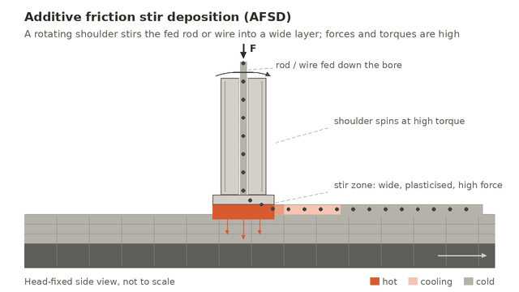

A rotating shoulder stirs fed rod or wire into a wide, plasticised layer. Tested; forces and torques run high.

### Additive friction extrusion deposition (AFED)

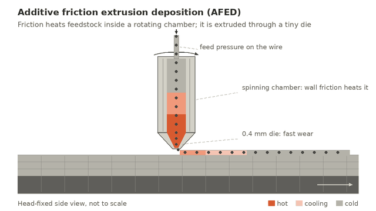

Feedstock is friction-heated inside a rotating chamber and extruded through a tiny die.

!!! warning "Check before relying on this"
    Check the die and chamber layout against the real setup.

### Additive friction roll bonding (AFRB)

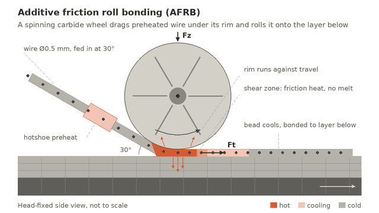

A spinning carbide wheel drags preheated wire under its rim and rolls it onto the layer below. The current working approach.

## Lasers

### Laser directed energy deposition (wire DED)

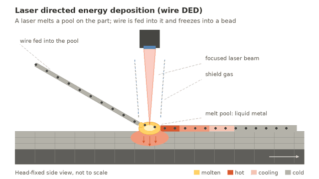

A laser melts a pool on the part; wire is fed into it and freezes into a bead. Melting, so it needs shield gas.

## Kinetic energy

### Cold spray

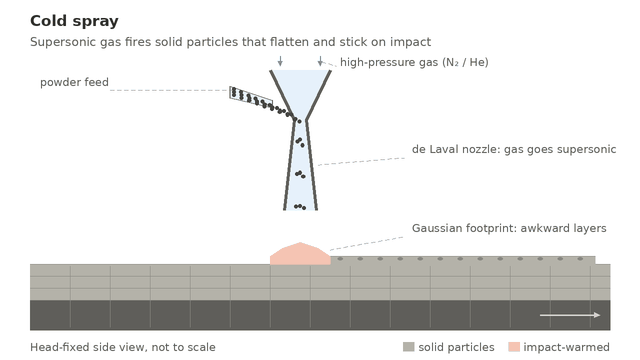

Supersonic gas fires solid particles that flatten and stick on impact. The Gaussian footprint complicates layers.

### Flame spray / detonation spray

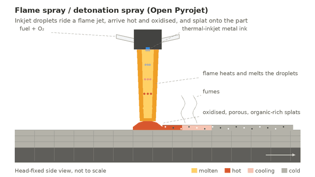

Thermal-inkjet metal-ink droplets ride a flame jet and splat onto the part, arriving hot and oxidised. This is the Open Pyrojet line.

## Acoustic energy

### Ultrasonic additive manufacturing (UAM)

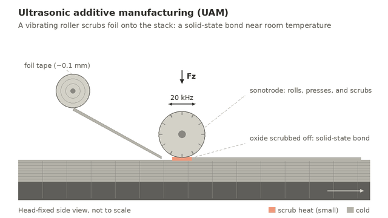

A vibrating roller scrubs foil onto the stack for a solid-state bond near room temperature.

### Thermosonic additive manufacturing

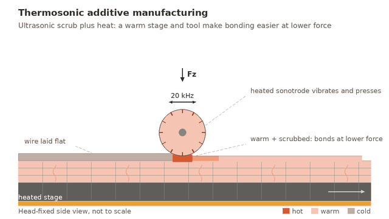

Ultrasonic scrubbing plus a heated stage and tool, so bonding happens at lower force.

!!! warning "Check before relying on this"
    The feedstock shown (wire laid flat) is a guess.

## Electrochemical

### Electrochemical additive manufacturing (ECAM)

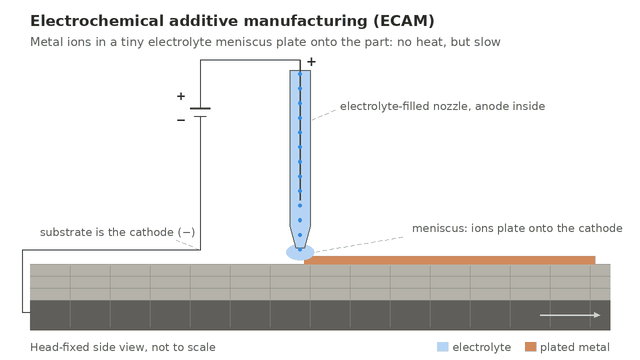

Metal ions plate onto the part through a tiny electrolyte meniscus. No heat, but slow.

### Laser-induced electrochemical deposition

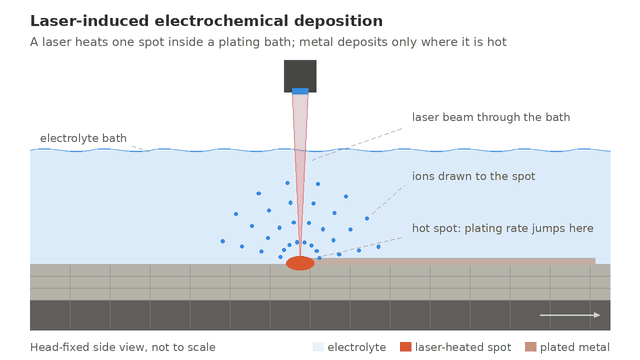

A laser heats one spot inside a plating bath; deposition happens only where it is hot.

!!! warning "Check before relying on this"
    Drawn electroless, with no electrodes; check whether the real process is driven.

## Heat and impact

### Heated micro power-hammer forging

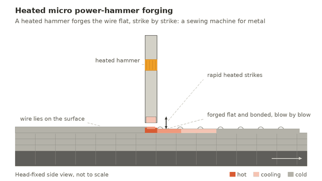

A heated ram forges flat-lying wire, strike by strike — a sewing machine for metal.

## Electric, arc and resistance

### Micro arc / plasma deposition

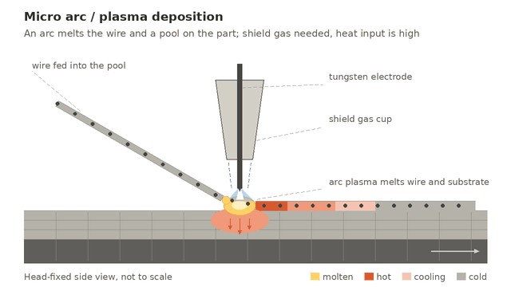

A micro arc melts the wire and a pool on the part under a shield-gas cup. Stands in for the whole arc / plasma / induction section.

### Joule printing

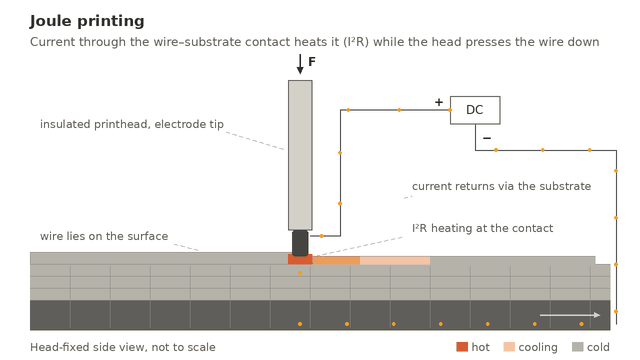

Current through the wire–substrate contact heats it (I²R) while the head presses the wire down; the current returns through the substrate.

### Micro welding

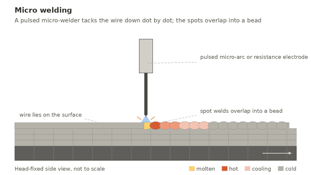

A pulsed micro-welder tacks flat-lying wire down dot by dot; the spot welds overlap into a bead.

!!! warning "Check before relying on this"
    The Discord thread may describe a different arrangement.

## Thermal (semisolid)

### Glow-plug semisolid direct write

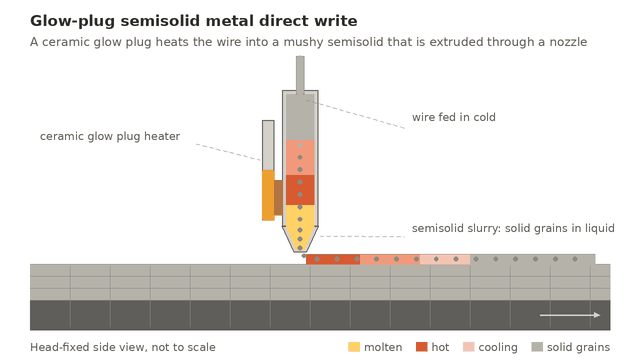

A ceramic glow plug heats wire into a mushy semisolid that is extruded through a nozzle.

### Induction-heated semisolid direct write

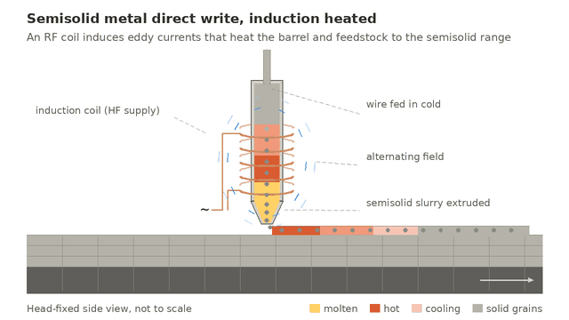

An RF coil induces eddy currents that heat the barrel and feedstock into the semisolid range.

### FDM-style semisolid direct write

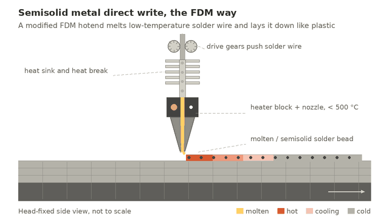

A modified FDM hotend melts low-temperature solder wire and lays it down like plastic.

## Combined: hot tool plus deformation

### Hot-tool orbital friction stirring

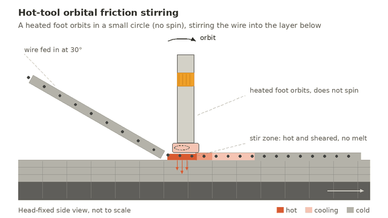

A heated foot orbits in a small circle (no spin), stirring the wire into the layer below.

### Hot-tool rotary vibro welding

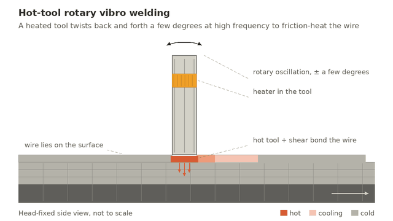

A heated tool twists back and forth a few degrees at high frequency to friction-heat the wire.

### Hot-tool linear vibro welding

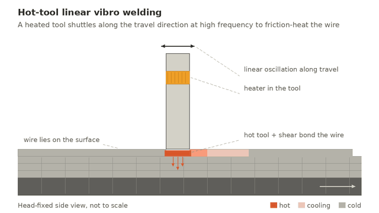

A heated tool shuttles along the travel direction at high frequency to friction-heat the wire.
